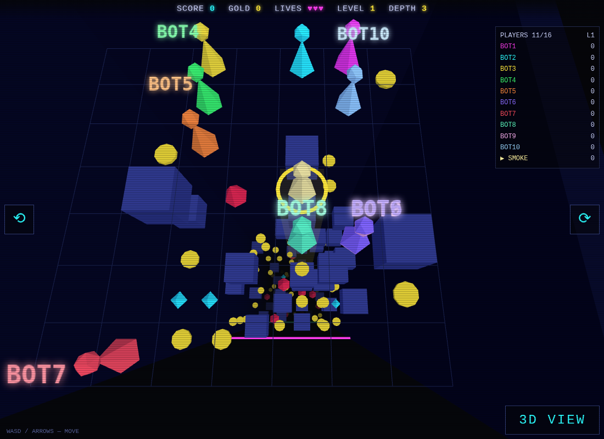

# Pitfall: Drop-Zone

**Fall. Dodge. Get rich. Go deeper.**

A lightweight multiplayer arcade game for the browser: up to **16 players**
fall down an endless neon shaft together, steering on a 7×7 grid to dodge
walls and hazards, grabbing coins and gems, and racing each other ever
deeper. Anyone can drop in mid-run at the current depth — but by the core
fairness rule, **you only score what you survive**.

A low-poly three.js re-imagining of the classic falling-down-the-well /
*Deep II*-style pit games.



## Features

- 🕳️ **Endless descent** — procedurally generated obstacle layers rush up at
  you, faster and denser every level
- 👥 **Drop-in multiplayer** — one always-open pit per server; open the URL,
  type a name, you're falling. No lobby, no accounts
- ⚖️ **Fair late joins** — depth score counts only levels *you* traveled
  since joining; nobody inherits progress
- 💰 **Coins, gems, lives** — 3 lives, ~2s of mercy after each hit, first
  player on the tile takes the loot
- 🏆 **Hall of fame** — session leaderboard on death, high scores persisted
  server-side
- 🎮 **Keyboard + touch** — WASD/arrows on desktop; swipe to hop on mobile,
  keep dragging to chain hops. HUD and overlays adapt to phone screens down
  to 320px wide
- 🎥 **Two cameras** — a chase cam that falls with you (default) or the
  classic 3D diorama; rotate either view in 90° steps, and a glowing helper
  column always marks the tile you're in
- 🖥️ **Retro-friendly rendering** — flat-shaded neon low poly with CRT
  scanlines, on a three.js build that still falls back to WebGL1 for old GPUs
- 🔌 **Drop-proof sessions** — background the tab, lock the phone, reload
  the page: your seat is held for 45 s and reclaimed automatically

## Quick start

```bash
npm install
npm start          # serves http://localhost:8080  (PORT=n to override)
```

Open the URL, type a name, **DROP IN**. Friends on the LAN join at
`http://<your-ip>:8080`.

## How to play

Your first visit opens a **QUICK START** overlay covering all of the below;
it never appears again once dismissed.

| Action | Desktop | Touch |
|---|---|---|
| Hop N / S / E / W | `WASD` / arrow keys | Swipe (drag to chain hops) |
| Switch camera | `CHASE CAM` / `3D VIEW` button | Same button |
| Rotate view 90° | ⟲ / ⟳ buttons at the screen edges | Same buttons |

Don't be under a wall or hazard when the layer sweeps past. Line up with
coins (`+10 gold, +10 score`) and gems (`+50 score`). Every 10 layers is a
level: `+600` score for each level you survive. Lose all 3 lives and you're
out — rejoining starts a brand-new run from the pit's current depth.

## Architecture

One Node.js process serves the static client and runs the authoritative game
over WebSocket at a 20Hz tick — clients send movement intents and render
interpolated snapshots; all collision, pickup, scoring, and death decisions
happen server-side.

```
server/   CommonJS — server.js (HTTP static + ws + tick pump), game.js (game logic)
shared/   const.mjs — tuning constants (cap, speeds, palette), served to the browser as-is
client/   No-build ES modules — session seam, three.js renderer, HUD, input
specs/    Design of record (v1 build plan, decision log)
tools/    Headless-browser smoke test
```

Dependencies: [`ws`](https://github.com/websockets/ws) at runtime,
[`playwright-core`](https://playwright.dev) for dev. three.js is vendored and
pinned at **r162** (the last WebGL1-fallback release). No build step, no
bundler, no framework.

## Development

```bash
npm test                     # server suite: real ws clients drive join/move/
                             # pickup/death/16-cap/drop-in fairness/pit reset
                             # + layer rebroadcast, env config + /healthz,
                             # hardening (markup-stripped names, socket cap,
                             # rate limit), seat grace + token reclaim
node tools/client_smoke.mjs  # real client in headless Chromium (SwiftShader):
                             # joins, verifies a synthetic touch swipe against
                             # server state, reloads to prove the seat token
                             # auto-reclaims, screenshots. BOTS=n for a crowd
node tools/mobile_smoke.mjs  # same client under phone emulation (touch, 3x
                             # DPR): quick-start, tap-to-join, swipe + rotated
                             # swipe, layout overflow checks, screenshots of
                             # portrait / landscape / 320px layouts
```

The browser smoke needs a cached Playwright Chromium (`CHROMIUM_PATH` to
override). Screenshots land in your temp dir unless you pass a path.

## Deploying

The game runs at **pitfall.kjell.today** on the shared Hetzner box, following
the multi-game hosting doctrine from the sibling `multiciv` repo
(`ops/multi-game-hosting.md`): one subdomain per game, one loopback-bound
port per game (pitfall owns **8130**), nginx in front for TLS and WebSocket
upgrade, and a hardened systemd unit with memory/CPU caps so no game can take
down its neighbours.

Deployment is an **allowlist rsync** (only `client/ server/ shared/` +
package files ever leave the machine), then `npm ci --omit=dev`, service
restart, and a deploy guard: `sleep 3` + `curl /healthz` so a crash-looping
unit fails the deploy loudly, plus a checksum comparison against partial
syncs. High scores live outside the synced tree on the box, so redeploys
never touch them. The server reads `PORT`, `HOST` and `SCORES_FILE` from
the environment and answers `/healthz` with a counts-only JSON body.

The deploy script, systemd unit, nginx block, and the step-by-step host
walkthrough are hosting-specific and deliberately **not in this repository**
(`ssh-deploy.sh`, `deploy.md`, `deploy/` are gitignored).

## Roadmap

Shops with items (Shield, Parachute, Magnet), zone themes per 10 levels,
music + audio (human-composed soundtrack in progress — design in
[`specs/game-soundtrack-design.md`](specs/game-soundtrack-design.md), plus
retro blip SFX), spectator camera, join codes / multiple rooms, global
leaderboard, seeded deterministic pits and replays.

## Lineage

Game design based on the *Deep II: 3D Descent* concept
(`retrogradegames/pitfall/multi-pitfall-design.md`); engineering doctrine
borrowed from the RetroMultiCiv/Fireline stack (server-authoritative views,
vendored-and-pinned dependencies, headless SwiftShader verification).
